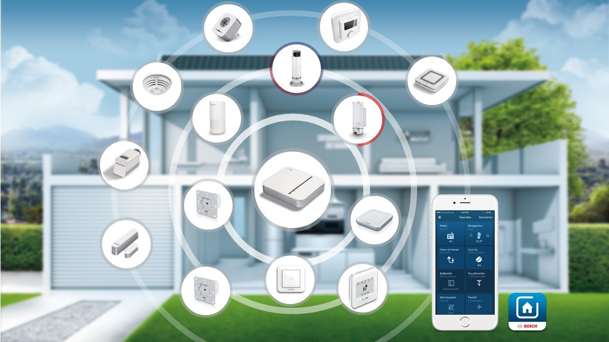

# Bosch Smart Home Controller Local REST API

#### Contents

- [Overview](#overview)
- [How to use the Postman Collection](postman/)
  * [Import the collection and the certificate into Postman](postman#import-the-collection-and-the-certificate-into-postman)
  * [Register a New Client to the Bosch Smart Home Controller](postman#register-a-new-client-to-the-bosch-smart-home-controller)
  * [Get events from the Bosch Smart Home Controller (Long Polling)](postman#get-events-from-the-bosch-smart-home-controller-long-polling)
- [Local OpenAPI Documentation](https://apidocs.bosch-smarthome.com/local/)
- [Terms and Conditions](#terms-and-conditions)

## Overview

[Bosch Smart Home](https://www.bosch-smarthome.com/) products allow you to automatically and remotely control the processes in your home. Each device has a unique purpose in your Smart Home and provides ease and convenience to your changing daily routines. Why do I need this? Because it means you can have more time to enjoy what matters to you. Whether you want to network your heating system or secure the safety of your home, the Bosch Smart Home System offers you complete and personalised solutions to you and your home's needs. This is all controlled by one handy app, so you can control your home, wherever you are. 

## Terms and Conditions
Robert Bosch Smart Home GmbH, Schockenriedstr. 17, 70565 Stuttgart, Germany ("Bosch Smart Home") provides a description of the local Bosch Smart Home Controller REST API, that allows **private, non-profit** Developers ("Developer") to locally control their Bosch Smart Home Devices.

By accepting these Terms and Conditions, through either accessing or using the API, the Developer agrees to be bound by these Terms and Conditions.

### Definitions
"API" refers to the interface functionality provided by Bosch Smart Home allowing private, non-profit Developers to access Bosch Smart Home Data.

"Application" refers to web or other software services or applications created by Developer that utilize or interact with the API and are authorized to be published.

"Client" refers to software created by developers using the API. Clients can be, for example (but are not limited to), mobile apps or web services.

"Data" refers to data made available by accessing the API of a specific, local and personally owned Smart Home Controller ("SHC").

"Documentation" refers to the provided API description and usage examples.

"Commercial" means intended for or directed towards commercial advantage or monetary compensation. 

Privacy Policy refers to the Privacy Policy found [here](https://www.bosch-smarthome.com/uk/en/privacy-statement).

### Purpose and License
These Terms and Conditions and any and all restrictions and policies implemented by Bosch Smart Home from time to time with respect to the API as set forth in the Documentation govern Developers rights to use and access the API for the purpose of developing, implementing and publishing Applications.

Subject to these Terms and Conditions, including the restrictions set forth, Bosch Smart Home grants to Developer a non-exclusive, non-transferable, non-sublicensable, worldwide, revocable right and license during the Term to privately use and make calls to the API to develop, implement and distribute Applications solely for non profit usage.

Developer grants to Bosch Smart Home a non-exclusive, worldwide, royalty-free license to market, sell and distribute such Applications; and to permit others to access, install, purchase and (in the case of downloadable software applications) download such Applications.

### Restrictions
The licenses of these Terms and Conditions are explicitly conditioned on Developers adherence to the following restrictions and compliance with its responsibilities as set forth herein.

The use of the API only applies to private, non-profit individuals. A commercial use in any way, either direct or indirect, is prohibited.

Using the API requires identification against the Bosch Smart Home Controller with an individual Client ID and Client Name that starts with "oss_" followed by the name of the open source project, or the name of the developer.

The Client must register with the primary role "ROLE_RESTRICTED_CLIENT".

Developer will be solely responsible for the technical installation and operation of its Applications; creating and displaying information and content on, through or within its Applications; ensuring that its Applications do not violate or infringe the Intellectual Property Rights of any third party; ensuring that Applications are not offensive, profane, obscene, libelous or otherwise illegal; ensuring that its Applications do not contain or introduce Malicious Software into a Service, an API, any Service Data or other data stored or transmitted using the Service; and ensuring that its Applications are not designed to or utilized for the purpose of spamming any Bosch Smart Home subscribers, Agents or End-Users.

Developers shall, in particular, not bypass any authentication or encryption mechanisms, or misuse API interfaces for purposes other than those, which are clearly intended by this Documentation (e.g. reading Data from the Bosch Smart Home System).

Developer shall not, under any circumstances, through Applications or otherwise, repackage or resell the Services, or any part thereof, API or Data.

Developer is not permitted to use the API, or any Data in any manner that does or could potentially undermine the security of the Services, the API, Data or any other information stored or transmitted using the Services.

In addition, Developer shall not, and shall not attempt to:  interfere with, modify or disable any features, functionality or security controls of the Services or the API, defeat, avoid, bypass, remove, deactivate or otherwise circumvent any protection mechanisms for the Service or the API, or reverse engineer, decompile, disassemble or derive source code, underlying ideas, algorithms, structure or organizational form from the Services or the API.

Developers shall fully comply with all applicable governmental, legal, regulatory and professional requirements when using the API, including but not limited to, copyright, trademark rights and data protection. The use of claims (e.g. "works with Bosch") or trademarks (e.g. Bosch logos of any kind) that indicates a direct or indirect involvement with Bosch is prohibited. 

Applications shall not, in any manner, display any form of advertising within or connected to any Service Data received by any Subscriber, Agent or End-User.

Bosch Smart Home may at its sole and exclusive discretion, change, alter, modify, add and remove features, content and other materials of the Documentation and/or API at any time. Bosch Smart Home may suspend or discontinue any feature or functionality provided at any time without any prior notice, obligation or liability. The developer is aware that changes in the API might require changes in the Client. The costs for such changes have to be borne by the developer.

Any technical implementation and fulfillment of system requirements of the API is the sole responsibility of the Developer. Developers are obliged to adhere to the requirements of the API, particularly regarding the correct technical integration and use of the API (see documentation). The user acknowledges that an incorrect technical integration or use may lead to defects in the functions of the API, or even the entire Client, or the connected Bosch Smart Home Devices.

Application shall not, and shall not attempt to connect with any Bosch backend system, which explicitly is not part of the allowed local API use, including systems provided by third parties.

Developers shall not use the API for any action that can cause damages due to the interaction of the API or the Client with the home appliances (e.g. by bypassing security prompts on the home appliances, or by executing commands that can cause harm to life or limb, or to the home appliances, or to any other goods).

Developers may produce and reproduce this Documentation for their own use, but may not share a modified or derived version of this Documentation.

Developers shall not use the API for publication of explicit content or offensive communication.

The Documentation is subject to the [Creative Commons Attribution-NonCommercial-NoDerivatives 4.0 International Public License](https://creativecommons.org/licenses/by-nc-nd/4.0/legalcode).

Developer must comply with all restrictions and guidelines set forth in this Agreement in all uses of the API and Data. If Bosch Smart Home believes, in its sole discretion, that Developer has violated or attempted to violate any term, condition or the spirit of this Agreement, the license afforded Developer pursuant to this Agreement may be temporarily or permanently revoked, with or without notice to Developer.

### Data
To the extent Developers Applications transmit Data outside a Service, Developer represents and warrants that he has notified all users of such Applications that their Data will be transmitted outside the Service and that Bosch Smart Home is not responsible for the privacy, security or integrity of such Data.

### Modifications
Developer acknowledges and agrees that Bosch Smart Home may modify this Agreement, the Services, the API, the General API Policies, and the Privacy Policy, from time to time (a "Modification"). Developer further acknowledges and agrees that such Modifications may be implemented at any time and without any notice. 

Developer acknowledges that a Modification may have an adverse effect on Applications, including but not limited to changing the manner in which Applications communicate with the API and display or transmit Data. 

Bosch Smart Home shall have no liability of any kind to Developer or any user of Developer's Applications with respect to such Modifications or any adverse effects resulting from such Modifications. 

### Warranty
Bosch Smart Home asks all Developers working with their Documentation to inform Bosch Smart Home about any defects found in the API as soon as possible to give Bosch Smart Home a chance to remedy it.

All aspects of the API, including all server and network components, are provided on an "as is" and "as available" basis. 

Developer acknowledges that Bosch Smart Home does not warrant that the API will be uninterrupted, timely, secure, or error-free and no information or advice obtained by Developer from Bosch Smart Home or through the Service shall create any warranty not expressly stated in this agreement. Besides that, the statutory warranty shall apply.

### Liability
In accordance with the provisions of law, Bosch Smart Home shall be liable for damages in the following cases: damage to persons; damage governed by the German Product Liability Act (Produkthaftungsgesetz); damage caused by fraudulent behavior or with intent on the part of Bosch Smart Home; and damage caused by gross negligence on the part of their legal representatives or executive staff.

Without prejudice to the liability defined in the section above, the Bosch Smart Homes liability for damages shall be limited to the level of damage foreseeable in contracts of this kind in the case of damage resulting from an ordinarily negligent breach of fundamental contractual obligations as well as in the case of damage caused due to gross negligence by the ordinary vicarious agents. 

Except where there are explicit provisions to the contrary in these Terms and Conditions, Bosch Smart Home shall bear no liability beyond that defined above.

Contributory negligence on the part of the Developer must be taken into account.

### Indemnity
Developer will indemnify and hold Bosch Smart Home harmless against any claim brought by a third party against Bosch Smart Home arising from or related to any breach of an obligation, representation, warranty, covenant or other provision of these Terms and Conditions by Developer or any matter which. Developer has expressly agreed to be responsible pursuant to these Terms and Conditions.

### Support
This Agreement does not entitle Developer to any support for the Services or the API, unless Developer makes separate arrangements with Bosch Smart Home for such support.

Developer acknowledges and agrees that Bosch Smart Home has no obligation to provide support or technical assistance to the users of Applications.

However, Bosch Smart Home will try their best to respond to issues raised in the [GitHub tracker](https://github.com/BoschSmartHome/bosch-shc-api-docs/issues). Developer should report any trouble he might have with the Documentation exclusively there.

### Confidentiality
Developer may from time to time, gain access to Confidential Information. Developer may use Confidential Information only to the extent necessary to exercise its rights under this Terms and Conditions. Subject to the express permissions set forth herein, Developer may not disclose Confidential Information to a third party without the prior express consent of Bosch Smart Home, provided in writing or by email. Without limiting any other obligation of Developer under this Terms and Conditions, Developer agrees that he will protect Confidential Information from unauthorized use, access, or disclosure in the same manner that Developer would use to protect its own confidential and proprietary information of a similar nature and in any event with no less than a reasonable degree of care.

### General provisions
To the extent permitted by law, the exclusive place of jurisdiction for any legal disputes shall be Stuttgart, Germany.

These Terms and Conditions as well as all agreements between Bosch Smart Home and the Developer in this regard shall be subject to German law. It is hereby explicitly stipulated that the United Nations Convention on Contracts for the International Sale of Goods shall not be applicable.

Should a provision be or become invalid, this shall not affect the validity or effectiveness of the other provisions. In such a case, the invalid provision should be replaced by a valid agreement that is as similar as possible to the commercial intention of the original, invalid provision.

*November 26th, 2019*
