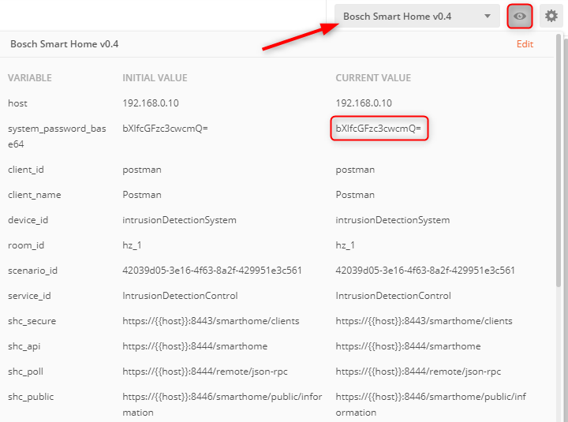

# How to use the Bosch Smart Home Postman Collection

To get started with the Postman Collection you need the following:

- Postman Collection and Environment downloaded to a local directory
- The IP address of your Smart Home Controller (SHC)
- A generated 2048 bit self signed certificate and the key to that certificate. 

**Hint:** Using OpenSSL a key pair can be generated with: `openssl req -x509 -nodes -days 9999 -newkey rsa:2048 -keyout client-key.pem -out client-cert.pem`

For security reasons you should consider to encrypt the key with: `openssl rsa -aes256 -in client-key.pem -out client-encrypted-key.pem`

## Import the collection, the environment, the certificate and the key into Postman
1. Start by importing the downloaded Postman Collection and Environment via the **Import** button of Postman. 

2. In the next step, you need to import the generated certificate (e.g. `client-cert.pem`) and the key (e.g. `client-key.pem` or `client-encrypted-key.pem`) into Postman. Therefore, open the **Settings** in Postman:

3.  On the **General** tab, disable **SSL certificate verification**:

4.  On the **Certificates** tab, click on **Add Certificate**:

5. Enter the **IP address** of your SHC and the port **8443**. After that, provide the requested files for the **certificate** and the **key**. If you use a **passphrase**, you should provide this information as well:

	
6. Click **Add** to add the certificate to your Postman Settings.

7. Do the same for port **8444**.

Now, you have all the prerequisites to communicate with your SHC via Postman. Start by checking the connection.

## Check the connection with the Bosch Smart Home Controller in your local network
1. On the left pane of Postman, select **Collections**

2. Double-click **Public Information**

3. In the upper right area of Postman, select the **Bosch Smart Home** environment

4. Click the icon with the eye

5. Edit the **Current Value** for **host**, enter the IP of your Bosch Smart Home Controller and close the environment window

6. Click the **Send** button

7. Your setup is correct when you receive a **200 OK** and some information about your Bosch Smart Home Controller

## Register a New Client to the Bosch Smart Home Controller
A client is a piece of software that has the permission to communicate with the Bosch Smart Home Controller. For example, the Bosch Smart Home App becomes a client of the Bosch Smart Home Controller upon successfully registration. All registered clients can be listed in the Bosch Smart Home App. To locate this in your app, go to `Management -> Mobile devices`. The communication between a client and the Bosch Smart Home Controller is always encrypted with TLSv1.2.

**Hint:** Before submitting the **New Client** request, always **press the Bosch Smart Home Controller's front-side button, until the LEDs begin flashing**.

To register a **New Client** to the Bosch Smart Home Controller, you need the following:

- A designated name of your open source software project
- The 2048 bit self-signed certificate from the previous step
- The system password of your Bosch Smart Home Controller, which you created upon initial setup

**Hint:** Your Bosch Smart Home Controller must already be initialized and paired with a Bosch Smart Home App!

### Naming convention for the Client ID and Client Name
Using the API requires identification against the Bosch Smart Home Controller with an individual Client ID and Client Name that starts with `oss_` followed by the name of the open source project, or the name of the developer. 

**Hint:** Please note that this naming convention is part of our [Terms and Conditions](https://github.com/BoschSmartHome/bosch-shc-api-docs#terms-and-conditions).

The **Client ID** and **Client Name** is already set in the Postman Environment. 

### Customize the certificate
To modify the certificate so that it fits into a JSON object, you have to manually remove all carriage returns, and additionally add `\r` before and after the certificate. Take the following example to illustrate this:

`"-----BEGIN CERTIFICATE-----\r` followed by the **2048 bit self signed certificate** and `\r-----END CERTIFICATE-----"`

Provide the **2048 bit self signed certificate** in the **body** of the **New Client** call.

If the certificate, or one of the defined query parameters was invalid, the Bosch Smart Home Controller will respond with `400 bad request`.

### Encode your password to base64

In order for the request to be accepted, you have to encode your Bosch Smart Home Controller password into base64. If you need a hint how to do this, there are many base64 encoders online. Just pick one and encode your password there. For instance, the base64 encoded password for `my_passw0rd` is `bXlfcGFzc3cwcmQ=`.

Enter the information of the **base64 encoded password** in the **Bosch Smart Home** environment.

If the password is wrong, the Bosch Smart Home Controller will respond with `401 unauthorized`.

### Add the client
1. Press the Bosch Smart Home Controller's front-side button, until the LEDs begin flashing
2. Click the "Send" button

After a couple of seconds the LEDs should stop flashing. Your client is now added.

### Delete a client

Please, start your Bosch Smart Home App.
1. Navigate to `Management -> Mobile devices`
1. Select the client you want to delete
1. Delete the client with the button at the bottom of the page

## Get events from the Bosch Smart Home Controller (Long Polling)

After registering a client to the Bosch Smart Home Controller, the requests in the Postman Collection for Long Polling should work without explicitly configuring them.

- Long Polling **Subscribe** returns a polling id. This id is needed to **Poll** and to **Unsubscribe**. In the **Test** tab, there is a function to store the polling id to the environment variable: `shc_poll_id`

- Long Polling **Poll** opens a connection and waits for a period of time to receive status updates from edge devices. The connection will be closed if an edge device sends a status update, or if no status updates are received during a period of time. To keep polling, you need to reopen the connection with the same polling id (`shc_poll_id`) again. 

- Long Polling **Unsubscribe** removes the subscription with `shc_poll_id`. 

**Hint:** If you are using **Long Poll**, it is normal that Postman waits for a certain amount of time. The connection stays open either until the polling time has expired, or a device has updated its status.
